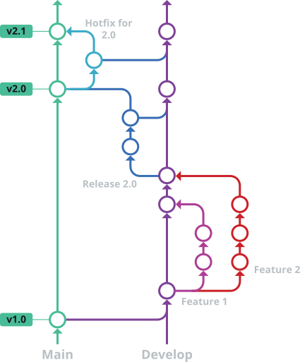

# Contributing

Use GitHub issues for confirmed bugs and focused feature proposals. Use pull requests for code and documentation changes.

## Development model

The repository uses [Git Flow](https://www.gitkraken.com/learn/git/git-flow). Create work from `develop`; release changes merge to the release branch through the project release process.

<div align="center" style="background:#0d1117"></div>

Name a work branch with this format:

```text
<type>/<github-user>-<random-id>-<description>
```

Generate the four-character ID with:

```sh
openssl rand -hex 2
```

For example:

```text
fix/kyau-a0e7-placeholder-cropping
```

Use a Conventional Commit type such as `feat`, `fix`, `docs`, `test`, `refactor`, or `ci` for `<type>`.

## Set up the checkout

Requirements for contribution checks:

- Node.js 22 or newer
- npm
- [gitleaks](https://github.com/gitleaks/gitleaks)
- [ShellCheck](https://www.shellcheck.net/)

Install dependencies and point Git at the tracked hooks:

```sh
npm install
npm run hooks:install
```

`npm run hooks:install` sets this checkout's `core.hooksPath` to `.github/hooks`. The pre-commit hook runs gitleaks and `npm run check`. The commit-message hook uses the local Commitlint installation.

## Make a change

1. Branch from the current `develop` branch.
2. Keep protocol parsing and cache limits explicit.
3. Add a regression test for behavior changes.
4. Update the public documentation when setup, output, or configuration changes.
5. Run the checks below.
6. Open a pull request against `develop`.

Do not allow malformed or partial Kitty payloads to reach terminal output. Preserve arbitrary byte-boundary handling when changing `KittyStreamTranslator`.

## Validate the change

Run the automated checks:

```sh
npm run check
npm pack --dry-run
```

Changes to `pi-images.tmux` must pass ShellCheck. Changes to terminal protocols also need a visual test in each affected path:

- Ghostty Kitty placeholders inside tmux
- SIXEL inside tmux, when the change affects SIXEL
- regular and fullscreen Pi TUI modes, when rendering order changes
- clearing, scrolling, resizing, and switching tmux windows

Record the terminal, tmux, Pi, and output mode versions in the pull request.

## Commit messages

Use [Conventional Commits](https://www.conventionalcommits.org/en/v1.0.0/):

```text
<type>(<optional-scope>): <summary>
```

Write the title as a short command. Use the body for rationale, constraints, migration notes, and test evidence. Commitlint enforces the format locally and in CI.

## Pull requests

A pull request should explain:

- the observed problem;
- the mechanism that caused it;
- the chosen change and relevant tradeoffs; and
- the automated and visual tests performed.

Keep unrelated changes in separate pull requests. Update tests and documentation in the same pull request as the behavior they cover.

## Report a bug or request a feature

Open an issue with the repository templates at [GitHub Issues](/../../issues). Image bugs need `/images-status` output and enough environment detail to identify the selected protocol path.

Do not attach sensitive images, terminal logs containing image payloads, credentials, or private session content.

## Release process

Create `release/X.Y.Z` from `develop`, then set the package version without creating a local tag:

```sh
git switch -c release/X.Y.Z develop
npm version X.Y.Z --no-git-tag-version
npm run check
npm pack --dry-run
```

Commit the resulting `package.json` and `package-lock.json` changes and open a pull request into `main`. When that pull request is merged, the release workflow:

1. verifies that both package files match `X.Y.Z`;
2. runs the package checks and builds the npm tarball;
3. creates and pushes the `vX.Y.Z` tag;
4. publishes the package to GitHub Packages;
5. creates a GitHub release with git-cliff notes and the npm tarball; and
6. opens a pull request from `main` back into `develop`.

The tarball attached to the GitHub release is ready for a separate manual npmjs.com publication. The workflow does not publish to npmjs.com.

Repository Actions settings must allow read and write workflow permissions and permit GitHub Actions to create pull requests. Optionally add a fine-grained `BACKMERGE_TOKEN` secret with repository contents read and pull-request write access. Using that token allows the back-merge pull request to trigger normal pull-request workflows; pull requests created with the default `GITHUB_TOKEN` do not trigger additional workflow runs.

## License

Contributions are submitted under the project's [GNU Affero General Public License v3.0](LICENSE). Do not submit code that cannot be distributed under that license. Preserve third-party notices and compatible license text when adapting existing work.
